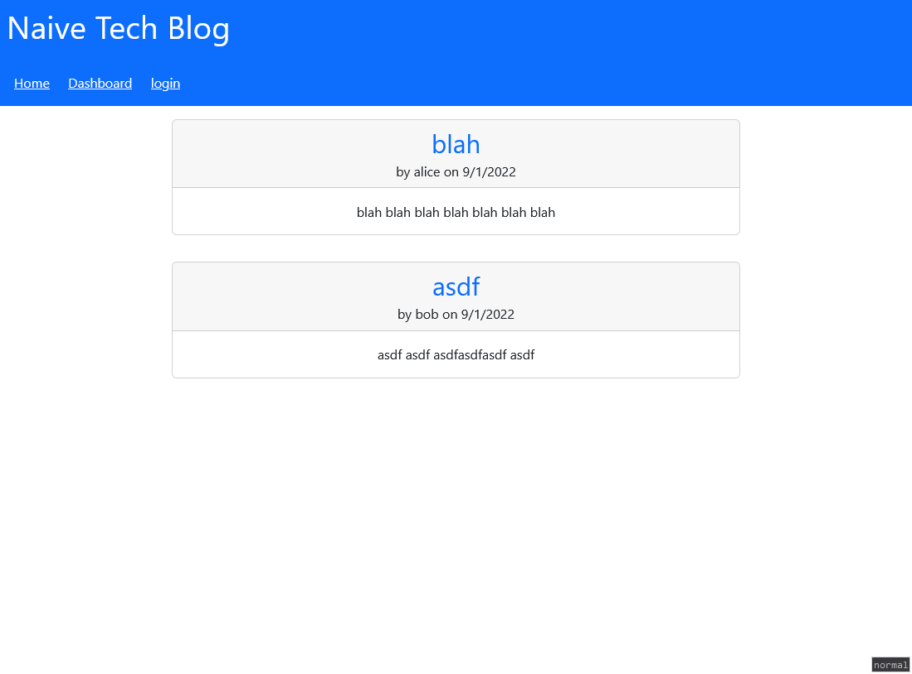

# Naive-Tech-Blog

## Table of Contents

1. [Description](#Description)
1. [Installation](#Installation)
1. [Deployed Instance](#Deployed)
1. [Questions](#Questions)

## Description

This app is a naive tech blog that allows you to create posts and comment on them.

## Installation

Clone the repository and run `npm install` inside of its directory.
Run `npm run db` to initialize the database.
Run `npm run seeds` to seed the database.
Supply a `.env` file to set up env vars.

## Deployed Instance

This [link](https://rocky-gorge-39079.herokuapp.com/) will take you to a deployed instance of the app.

## Questions

Github Account: [rrrbbbsss](https://github.com/rrrbbbsss)
